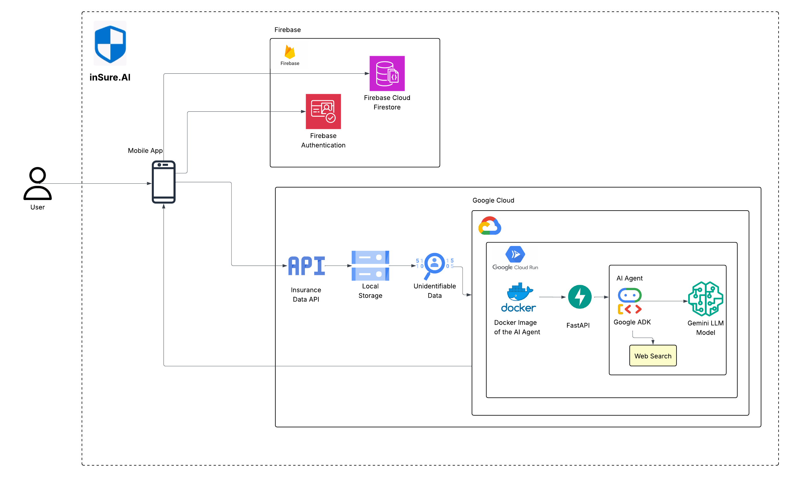

# inSure.AI: Agentic Health Insurance Navigator

## 🏆 Agentic AI App Hackathon Submission

## 📌 Project Overview

inSure.AI leverages agentic AI to revolutionize healthcare navigation by automating insurance analysis and decision-making during medical emergencies. Our solution helps patients find appropriate care facilities while understanding their financial responsibility.

## 🚀 The Problem & Solution

### The Problem
When facing medical emergencies, people struggle with:
- Determining which hospitals accept their insurance
- Understanding potential out-of-pocket costs
- Making informed decisions under stress

### Our Solution
inSure.AI delegates these complex tasks to an intelligent Gemini-powered agent that:
1. **Analyzes insurance policies** - Extracting coverage details, deductibles, and limitations
2. **Evaluates medical needs** - Identifying potential procedures for specific symptoms
3. **Locates nearby facilities** - Finding and ranking hospitals by relevance
4. **Calculates expected costs** - Determining insurance coverage vs. personal responsibility
5. **Presents actionable options** - Enabling immediate contact or navigation to facilities

## 💡 Agentic Architecture

Our application uses a google-agent system where specialized the agent does below:

- **Policy Analyzer** - Parses insurance documentation
- **Medical Procedure Estimator** - Maps symptoms to likely treatments
- **Cost Calculator** - Applies insurance rules to procedure costs
- **Location Coordinator** - Finds and ranks nearby facilities
- **Orchestrator Agent** - Coordinates the workflow and presents results

The Gemini LLM serves as both the reasoning engine and coordinator across these specialized functions.

## 🛠️ Technical Implementation

- **Frontend**: SwiftUI for iOS interface
- **Backend**: Firebase for authentication and data management
- **AI Component**: Gemini LLM API for intelligent analysis
- **Data Processing**: Local-first approach with minimal storage for privacy
- **Integration**: Real-time connection to insurance eligibility verification APIs

## 🌟 Key Differentiators

Unlike standard healthcare apps that simply display data, inSure.AI:

- **Takes initiative** - Proactively gathers relevant information
- **Makes decisions** - Evaluates options based on multiple factors
- **Explains reasoning** - Provides transparency into recommendations
- **Presents actionable options** - Enables immediate next steps

## 📊 Societal Impact

inSure.AI addresses critical healthcare accessibility issues:
- Reduces financial uncertainty in medical emergencies
- Democratizes access to insurance expertise
- Decreases the likelihood of surprise medical bills
- Empowers patients with knowledge typically reserved for insurance experts

## 🔒 Privacy & Ethics

Our agent architecture prioritizes:
- Minimal data storage with local-first processing
- Transparent explanations of recommendations
- Ethical presentation of medical options without bias
- HIPAA-compliant data handling

## 📱 User Interface

### Onboarding Flow

### Insurance Analysis

### User Symptom Input

### Hospital Recommendations

### Cost Breakdown

### Hospital Direction

## 🔮 Future Development

We plan to expand our agent's capabilities to:
- Negotiate bills on behalf of users
- Schedule appointments autonomously
- Track and submit claims
- Monitor insurance usage throughout the year
- Proactively suggest preventative care options

## 📋 Submission Checklist

- [x] All code in `src/` runs without errors
- [x] `ARCHITECTURE.md` contains a clear diagram sketch and explanation
- [x] `EXPLANATION.md` covers planning, tool use, memory, and limitations
- [x] `DEMO.md` links to a 3–5 min video with timestamped highlights

## 🎬 Demo

See our [DEMO.md](DEMO.md) for a video walkthrough with the following highlights:
- 0:45 - User onboarding and insurance verification
- 1:30 - Insurance policy analysis and summary
- 2:15 - Symptom search and hospital recommendations
- 3:00 - Cost breakdown and comparison
- 3:45 - One-tap facility contact and directions

---

*inSure.AI - Your personal healthcare navigator, powered by intelligent agency*
